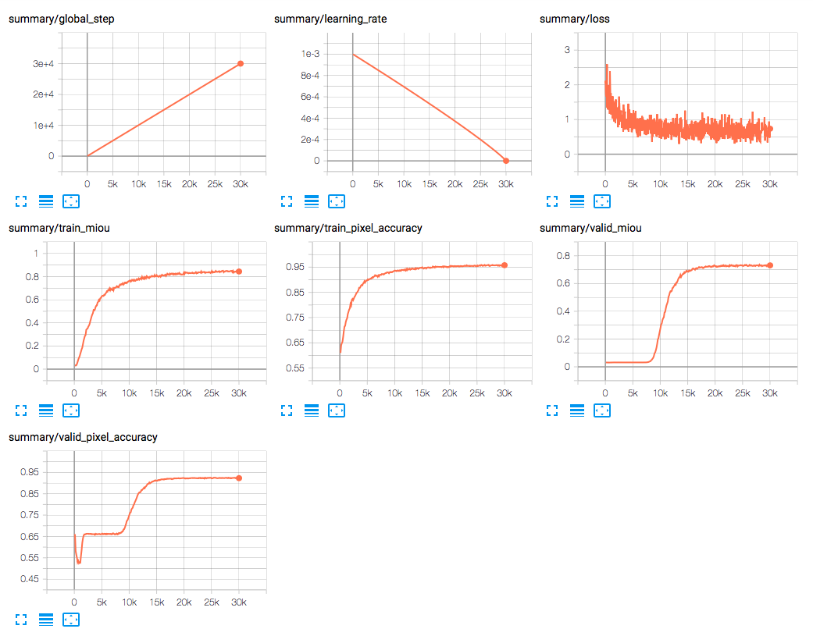
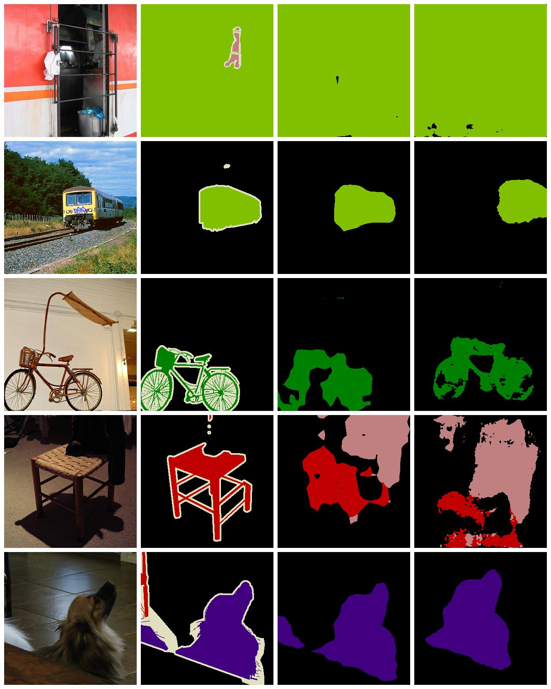
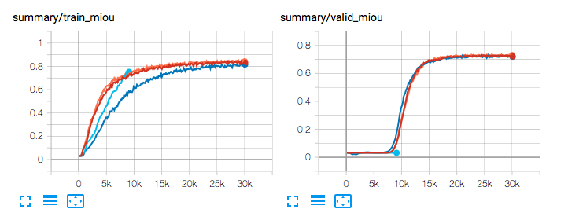

# DeepLab v3+ tensorflow implementation
[](https://www.tensorflow.org/)  
Tensorflow implementation of [DeepLab v3+](http://openaccess.thecvf.com/content_ECCV_2018/papers/Liang-Chieh_Chen_Encoder-Decoder_with_Atrous_ECCV_2018_paper.pdf).
Although you can find [the official implementation](https://github.com/tensorflow/models/tree/master/research/deeplab) from Google research,
it took a lot of time to understand the codes mainly because of intensive usage of high level tensorflow API and complex dependency in between each script.
Thus, we decided to re-implement DeepLab v3+ by myself to understand the architecture and see the representation capacity. 
Also we provide minimal configuration by which one can run training on machine with only single GPU, since 
the original configuration in the paper requires pretty high spec machine with multiple GPUs because of the huge model size.
Some parts of this repository, such as scripts of Xception/ResNet and those pre-trained checkpoints, are directory inherited from the official implementation.  

## GET STARTED

```
git clone https://github.com/asahi417/SemanticSegmentation
cd SemanticSegmentation
pip install .
```


## TRAIN MODEL
Train DeeplLab model over some benchmark dataset.
 
### download dataset and converting as TFRecord 
Public benchmark datasets for semantic segmentation, including [PASCAL](http://host.robots.ox.ac.uk/pascal/VOC/voc2012/) and [ADE20k](https://groups.csail.mit.edu/vision/datasets/ADE20K/),
will be downloaded and converted as TFRecord by following script.

```
./bin/build_tfrecord.py [-h] [-d [DATA]]

Encoding to tfrecord.

optional arguments:
  -h, --help            show this help message and exit
  -d [DATA], --data [DATA]
                        Dataset name (`pascal` or `ade20k`)
```      
 
A directory (`./data/data` and `./data/tfrecords`) will be created as the place to store data related files.

### training
Once the tfrecord is ready, you train model ([default parameter](./deep_semantic_segmentation/parameter_manager/deeplab)).

```
./bin/train.py [-h] [-d [DATA]] [-m [MODEL]] [-b [BATCH_SIZE]]
                [-l [LEARNING_RATE]] [-w [WEIGHT_DECAY]]
                [--aspp_depth [ASPP_DEPTH]] [--crop_size [CROP_SIZE]]
                [--output_stride [OUTPUT_STRIDE]] [--off_decoder]
                [--off_fine_tune_batch_norm] [--backbone [BACKBONE]]
                [--checkpoint [CHECKPOINT]]

optional arguments:
  -h, --help            show this help message and exit
  -d [DATA], --data [DATA]
                        Dataset
  -m [MODEL], --model [MODEL]
                        Model
  -b [BATCH_SIZE], --batch_size [BATCH_SIZE]
                        Batch size
  -l [LEARNING_RATE], --learning_rate [LEARNING_RATE]
                        learning rate
  -w [WEIGHT_DECAY], --weight_decay [WEIGHT_DECAY]
                        weight decay
  --aspp_depth [ASPP_DEPTH]
                        aspp depth
  --crop_size [CROP_SIZE]
                        crop size
  --output_stride [OUTPUT_STRIDE]
                        output_stride
  --off_decoder         unuse decoder
  --off_fine_tune_batch_norm
                        off_fine_tune_batch_norm
  --backbone [BACKBONE]
                        backbone network
  --checkpoint [CHECKPOINT]
                        checkpoint

```

The checkpoints will be created under `./data/checkpoints/model/DeepLab/` and you can launch tensorboard (`tensorboard --logdir==.`) 
to monitor training progress.

<p align="center">
  
  <br><i>Fig 1: tensorboard view for learning curve </i>
</p>

<p align="center">
  
  <br><i>Fig 2: tensorboard view for sample prediction </i>
</p>

For pascal data, it takes 5 days on single Tesla K80.

## RESULT
We trained DeepLab with couple of hyperparameter combinations and results are as below.

|  model  | decoder | backbone     | mIoU | pixel accuracy |
|:-----:| ------- | ------------ | ---- | -------------- | 
| **A**   | `False` | `Xception41` | TBA  | TBA | 
| **B**   | `False` | `Xception65` | TBA  | TBA |
| **C**   | `True`  | `Xception41` | TBA  | TBA |
| **D**   | `True`  | `Xception65` | TBA  | TBA |

Backbone network checkpoints are downloaded from google's [model zoo](https://github.com/tensorflow/models/blob/master/research/deeplab/g3doc/model_zoo.md) (as Xception65, one trained with Coco is employed here).
We fix output stride of atrous convolution module to be 16 and decoder output stride as 4, so total output stride 
(input width/output width) is 4 if decoder is `True`, otherwise 16.

### discussion 1: decoder    
To see the effect of decoder module, we show some sample predictions from validation dataset of PASCAL in figure 3.
 
<p align="center">
  
  <br><i>Fig 3: From left to right, (i) original image, (ii) ground truth, (ii) model without decoder, (iv) model with decoder </i>
</p>

Model **B** is used as without decoder and **D** as with decoder.  

### discussion 2: learning behavior  
As you can see in figure 4, there is a common pattern in learning curve that validation mean IoU stays in plateau of low accuracy
for first 8k steps and then increase massively, while training mIoU increase constantly. 
  
<p align="center">
  
  <br><i>Fig 4: mIoU learning curves over training/validation data </i>
</p>

This might be the effect of batch normalization that the mean/variance statistics requires
 to be stable in training data for inference.
